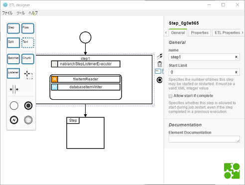
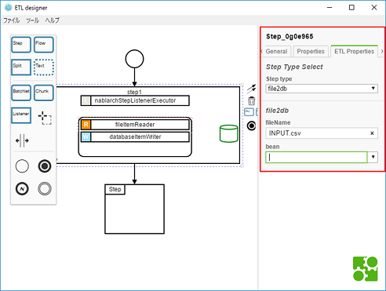

# ETLデザイナー
- ETLデザイナーの紹介
    - ETLデザイナーとは
    - ETLデザイナーでできること
    - 前提・制約
    - ライセンス
    - 利用申請
    - フィードバック
- [アーキテクチャ](doc/architecture.md)
- [チュートリアル](doc/tutorial.md)
- [セットアップガイド](doc/setup-guide.md)
- [操作ガイド](doc/operation-guide.md)

## ETLデザイナーとは
- JSR352に準拠したバッチジョブ、並びにNablarchのETLの設計/実装を行うデスクトップアプリケーションです。
- ETLデザイナーにより、バッチの設計/実装の効率上昇を目指します。

## ETLデザイナーでできること
- GUIでバッチジョブ、ETLの設計/実装ができます。
    - ビジネスプロセスモデリング表記法(Business Process Model and Notation 2.0, 以降BPMN)を使用してジョブ定義を行います。
    - バッチの部品(Step、Listener等)に該当するBPMN図形を配置・接続していくことで、ジョブの流れを定義します。
    - 
    - Stepを配置し、1個目のStepにListenerとChunkを設定しています。
    - Stepで処理の対象となるファイル名やbeanを設定することで実装が行えます。
    - 
    - 1個目のStepでデータの入力元となるファイル名を設定しています。
- ETLのテンプレートを使用することで、ジョブの設計を定型化できます。

- 設定ファイルが出力できます。
    - GUIで作成したジョブ定義を元に、バッチで使用するJOB定義ファイルとETL用JOB設定ファイルが出力できます。
    - 出力したファイルを用いてすぐにバッチを動作させることができます。

## 前提・制約
- ETLデザイナーを用いてバッチを設計するにあたって、JSR352、NablarchのETLの知識が必要になります。
    - JSR352のバッチに関しては[このあたり](https://www.google.co.jp/search?ei=8E8BWrKNLIz88gXPpaEI&q=JSR352&oq=JSR352&gs_l=psy-ab.3..0l2j0i7i30k1l6.4271.4625.0.5098.3.3.0.0.0.0.98.256.3.3.0....0...1.1.64.psy-ab..0.3.255....0.gCW8AHGw38M)を参考にしてください。
    - NablarchのETLに関しては[NablarchのドキュメントのETLのページ](https://nablarch.github.io/docs/LATEST/doc/extension_components/etl/index.html)を参考にしてください

- ETLデザイナーはAWS上のAPIサーバを利用します。
    - 設定ファイルを出力する際に、AWS上のAPIサーバにアクセスします。
    - AWSへはtetra環境からのみアクセスできます。

## 動作環境
- Windows端末でのみ利用可能です。
- 動作を確認した環境は以下になります。
    - Windows10 64bit
    - Windows7 32bit

## ライセンス
ETLデザイナーは Apache License 2.0 で提供します。

## 利用申請


## フィードバック
使ってみた感想、要望、不具合など、フィードバックをお待ちしています。

[フィードバックシステム](http://adcfb.intra.tis.co.jp/redmine/feedbktop?id=0001-04-0001)

## Getting Started

```
git submodule update -i
npm install
node_modules/.bin/grunt auto-build
node_modules/.bin/electron . --dev
```
