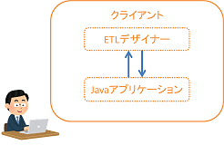

# ETLデザイナー
- ETLデザイナーの紹介
    - [ETLデザイナー](#etletlデザイナー)
    - [前提知識](#前提知識)
    - [制約](#制約)
    - [アーキテクチャ](#アーキテクチャ)
    - [動作環境](#動作環境)
    - [ライセンス](#ライセンス)
- [Getting Started](doc/getting-started.md)
- [利用方法](doc/operation-guide.md)
- [利用申請](#利用申請)
- [フィードバック](#フィードバック)

## ETL/ETLデザイナー

単純なデータロードやデータ出力のバッチ作成の際に、他のバッチと同じように詳細に設計書を書き、
重いテストをすることが、特に大規模開発における生産性向上の阻害要因となっています。
この問題を解消するため、SQLとBeanの作成、そしていくつかの設定を行うだけで、
バッチを作成できる[ETL](https://nablarch.github.io/docs/LATEST/doc/extension_components/etl/index.html)が登場しました。

そして、この[ETL](https://nablarch.github.io/docs/LATEST/doc/extension_components/etl/index.html)をさらに使いやすくするため、
ETLデザイナーを開発しました。

ETLデザイナーを使うと、バッチの処理フロー等の定義をGUIでモデリングでき、[ETL](https://nablarch.github.io/docs/LATEST/doc/extension_components/etl/index.html)で実行可能な設定ファイルを出力できます。
ETLデザイナーにより、バッチの設計/実装作業を大幅に簡略化し、生産性向上を実現します。


## 前提知識
ETLデザイナーを用いてバッチを開発するにあたって、Nablarchの[ETL](https://nablarch.github.io/docs/LATEST/doc/extension_components/etl/index.html)、JSR352の知識が必要になります。  
以下の点が分からない方は、[JSR352とETLの簡単な説明](doc/jsr352-etl-simple-guide.md)を参照ください。
- JSR352
    - Job、Step、Listener、Chunk、Batchletといった用語
    - ChunkとBatchletの違い

- ETL
    - ETLで提供しているChunkとBatchletの使い方
        - ChunkやBatchletで必要となるもの(BeanやSQL)
        - ChunkやBatchletの設定内容
    
詳しい仕様に関しては、以下を参照ください。
  - [JSR352の仕様原本(英語)](https://jcp.org/en/jsr/detail?id=352)
  - [NablarchドキュメントのETL](https://nablarch.github.io/docs/LATEST/doc/extension_components/etl/index.html)

## 制約
実行環境に以下のソフトウェアが必要です。
- Java Version 8

詳細はアーキテクチャの項を参照ください。

## アーキテクチャ

- ETLデザイナーではビジネスプロセスモデリング表記法(BPMN)を用いてJOB定義を行います。
- BPMN形式のJOB定義をJSR352のJOB定義に変換する機能は、Javaアプリケーションを利用します。
- そのため、実行環境にJavaが必要になります。

## 動作環境
- Windows端末でのみ利用可能です。
- 動作確認した環境は以下になります。
    - Windows10 64bit
    - Windows7 32bit

## ライセンス
Apache License 2.0  
[LICENSE](LICENSE.txt)

## [Getting Started](doc/getting-started.md)
テンプレートを使用した簡単なETLバッチ作成の解説です。

## [利用方法](doc/operation-guide.md)
ETLデザイナーの詳細な操作マニュアルです。

## 利用申請

ETLデザイナーをご利用の皆様には、改善を目的としたフィードバックをお願いする予定です。
利用プロジェクトを把握するため、ETLデザイナーの実行ファイルは申請による提供を行います。
ご協力お願い致します。

申請は、下記内容を添えてメールでご連絡ください。

- 宛先
  - adc_support@pj.tis.co.jp
- タイトル
  - ETLデザイナー希望
- 本文
  ```
  利用部門　　：（部門略称）
  連絡先　　　：（社員番号、お名前）
  ＰＪ名　　　：（学習・評価目的の場合は、「学習用」「評価用」）
  顧客名　　　：
  利用開始～終了時期：
  PJ種別　　　：（新規/保守/保守開発のいずれか）
  ```

## フィードバック

使ってみた感想、要望、不具合など、フィードバックをお待ちしています。

[フィードバックシステム](http://adcfb.intra.tis.co.jp/redmine/feedbktop?id=0001-04-0001)