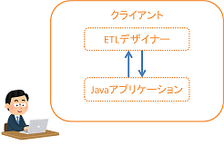

# アーキテクチャ
- 
- ETLデザイナーではビジネスプロセスモデリング表記法(BPMN)を用いてジョブ定義を行います。
- BPMN形式で記述されたジョブ定義をバッチで使用するジョブxml形式に変換する機能は、[JobStreamer](http://job-streamer.github.io/ja/)を使用します。
- JobStreamerがRESTで上記の機能を提供しているため、APIサーバが必要となります。
- そのため、ETLデザイナーはデスクトップアプリケーションと、APIサーバからなります。

## サーバの運用に関して
- 2017/12時点ではSED内部の運用レベルでサービスを提供します。
- 営業日・定時の範囲内です。
- Tetra以外からは利用できません。
