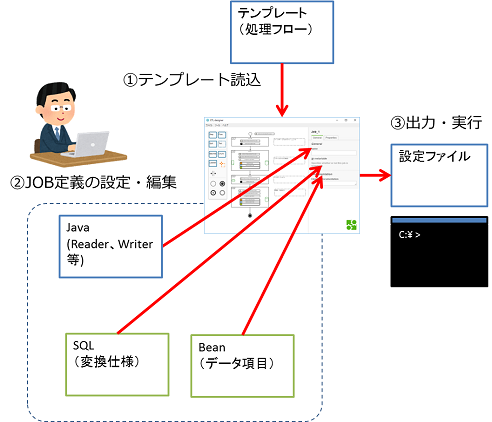
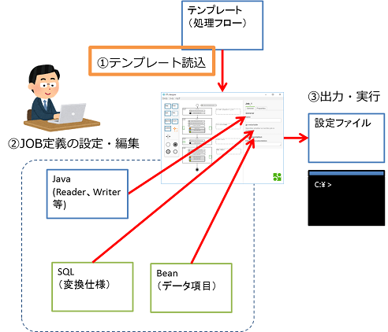
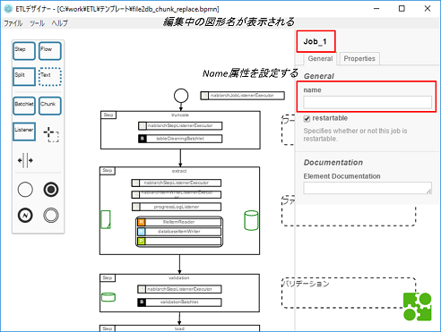
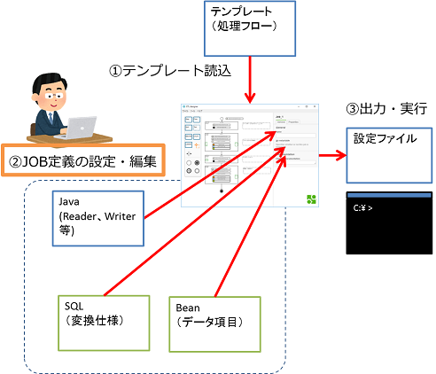
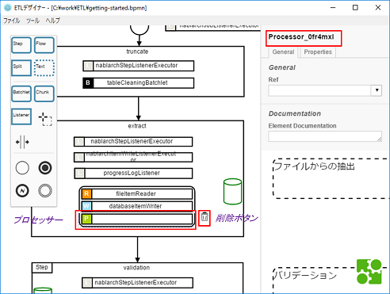
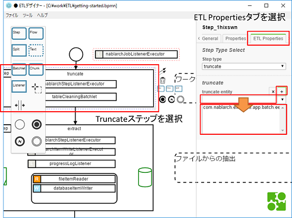
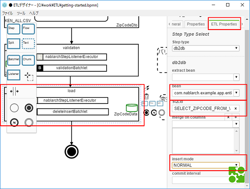

# Getting Started

このGetting Startedでは、ETLデザイナーを使用して、簡単なバッチを開発します。

- [事前準備](#事前準備)
- [バッチの仕様](#バッチの仕様)
- [開発の進め方](#開発の進め方)
- [ETLデザイナーの起動](#etlデザイナーの起動)
- [1.テンプレート読み込み](#1テンプレート読み込み)
- [2.JOB定義の編集](#2job定義の編集)
- [3.プロパティパネルでの設定](#3beansqlの作成とプロパティパネルでの設定)
- [4.設定ファイルの出力](#4設定ファイルの出力)
- [5.バッチの実行](#5バッチの実行)

## 事前準備

バッチアプリケーションは、NablarchのExampleを使います。
そのため、実行環境にJava、Maven、Gitが必要になります。

- ETLデザイナーをインストールしてください。
    - [インストール](operation-guide.md#インストール)
- テンプレートをダウンロードしてください。
    - [テンプレート](operation-guide.md#テンプレート)
- NablarchのExampleをgit cloneしてください。(git cloneするだけで大丈夫です)
    - [nablarch-example-batch-ee](https://github.com/nablarch/nablarch-example-batch-ee)

## バッチの仕様

このGettingStartedで作成するバッチの仕様です。

- 郵便番号データの取り込みバッチ
- データ形式
    - インプット：CSVファイル
    - アウトプット：DB
- バリデーション
    - あり
    - エラーデータはエラー格納用の別テーブルに格納する
    - エラーがあっても処理を継続する
    - ただしエラー件数が1000を超えた場合は処理を終了させる
- 取り込み方法
    - Extractフェーズ：Chunk
    - Loadフェーズ：Batchlet(洗い替え)

※データ項目と変換仕様は、業務仕様に依存するため、GettingStartedでは省略します。Exampleにあるデータ項目(Bean)と変換仕様(SQL)を使用します。

## 開発の進め方

ETLデザイナーでの開発の流れです。



## ETLデザイナーの起動

- ETLデザイナーを起動すると以下の画面が表示されます。


## 1.テンプレート読み込み



- [バッチ仕様](#バッチの仕様)を元に、使用する[テンプレート](operation-guide.md#テンプレート)を決定します。
- ファイル＞開くを選択し、file2db_chunk_replace.bpmnを選択します。

- テンプレートを開くとJOB定義が表示されます。図形の説明は[利用方法の図形の説明](operation-guide.md#図形の説明)を参照ください。

- JOBの名前の設定
    - キャンバス上で図形がない場所をクリックすると、プロパティパネルでJobの属性が編集できるようになります。  
    - Jobのname属性に「getting-started」を設定します。
    - Jobのname属性はJOB定義ファイルのJobのid属性に反映されます。
    
    

- JOB定義の保存
    - テンプレートファイルの上書き保存を避けるため、別ファイルとして保存します。
    - ファイル＞名前を付けて保存を選択します。
    - ファイル名を「getting-started」にして、任意の場所に保存します。
    - タイトルに表示されるファイルのパスが保存した「getting-started.bpmn」の物に変わります。

## 2.JOB定義の編集



[バッチ仕様](#バッチの仕様)を元に、テンプレートのJOB定義を編集します。
- 今回のバッチではファイル取り込みのChunkでProcessorを利用しないため、Processorの図形を削除します。
    - Processorをクリックし、図形の右に表示されるゴミ箱ボタンを押すか、deleteボタンを押すことで削除ができます。

  

- 保存されていない編集内容がある場合、タイトルの「ETLデザイナー」の左側に「●」が表示されます。保存すると「●」が消えます。

## 3.Bean、SQLの作成とプロパティパネルでの設定


バッチで使用するBean、SQLの作成と、プロパティパネルでのETLの設定を行います。

- Bean、SQLの作成
    - ETLで使用するBeanとSQLを作成します。
    - このGetting Startedでは[NablarchのExampleプロジェクト](https://github.com/nablarch/nablarch-example-batch-ee)を使用するため省略します。
    - 実装する際には、Nablarchのドキュメントの[4.3. ETLを使用するバッチの設計ポイント](https://nablarch.github.io/docs/LATEST/doc/extension_components/etl/index.html#id5)を参照ください。

ファイル→DBのETLでは以下の物を作成します。また、今回使用する[NablarchのExampleプロジェクト](https://github.com/nablarch/nablarch-example-batch-ee)ではそれぞれ以下に対応します。
- ワークテーブルのBean: <nablarch-example-batch-eeをcloneしたディレクトリ>\src\main\java\com\nablarch\example\app\batch\ee\dto\csv\ZipCodeDto.java
- エラーテーブルのBean: <nablarch-example-batch-eeをcloneしたディレクトリ>\src\main\java\com\nablarch\example\app\batch\ee\dto\csv\ZipCodeErrorEntity.java
- 本テーブルのEntity: gspプラグインによって自動生成されます
- ワークテーブルから本テーブルへデータを取り込むSQL: <nablarch-example-batch-eeをcloneしたディレクトリ>\src\main\resources\com\nablarch\example\app\entity\ZipCodeData.sql

Bean、SQLを設定するイメージです。

  

ここからステップの設定をしていきます。編集したいステップをクリックすることでプロパティパネルで設定が可能になります。
ETLの設定はプロパティパネルのETL Propertiesタブで行います。入力した値はすぐに反映されます。

- truncateステップの設定
    - truncateステップでは、削除するワークテーブルの設定を行います。
    - truncate entity属性: com.nablarch.example.app.batch.ee.dto.csv.ZipCodeDto
        - データを削除したいワークテーブルに対応するEntityの完全修飾名
    - テキストエリアに値を入力し、「＋」ボタンを押してリストに追加します。
    
    
    
- extractステップの設定
    - extractステップでは、入力ファイルとデータを取り込むワークテーブルの設定を行います。
    - fileName属性: KEN_ALL.CSV
        - 入力元ファイル名
    - bean属性: com.nablarch.example.app.batch.ee.dto.csv.ZipCodeDto
        - 入力ファイルとワークテーブルのデータ項目に対応したBeanの完全修飾名
    
    
    
- validationステップの設定
    - validationステップでは、ワークテーブルに取り込んだデータのバリデーションの設定を行います。
    - bean属性: com.nablarch.example.app.batch.ee.dto.csv.ZipCodeDto
        - バリデーション対象のワークテーブルに対応したBeanの完全修飾名
    - errorEntity属性: com.nablarch.example.app.batch.ee.dto.csv.ZipCodeErrorEntity
        - バリデーションエラーとなったデータを格納するエラーテーブルに対応するEntityの完全修飾名
    - mode属性: CONTINUE
        - バリデーションエラー発生時のJOBの継続モード
    - errorLimit属性: 1000
        - 許容するエラー数
    
    
    
- loadステップの設定
    - loadステップでは、ワークテーブルから本テーブルへのデータの取り込みの設定を行います。
    - bean属性: com.nablarch.example.app.entity.ZipCodeData
        - 洗い替え対象テーブルに対応したBean の完全修飾名
    - SQLId属性: SELECT_ZIPCODE_FROM_WORK
        - データベースのテーブルに登録するデータを取得する際に使用するSQLのID
    - insertMode属性: NORMAL
        - データの登録(INSERT)時に使用するモード
    
    
    
以上でプロパティパネルでの設定は終わりです。
    
## 4.設定ファイルの出力


定義したジョブを、バッチで使用するJOB定義ファイルとETL用JOB設定ファイルに変換します。


- 変換する前に、JOB定義のバリデーションを行います。
- ツール＞バリデーションを選択するとバリデーションウィンドウが表示されます。
    - エラー、警告、ジョブのテスト実行の各タブにバリデーション結果が表示されます。今回の手順ではバリデーションエラーは発生しません。
- ツール＞変換を選択します。
- ファイル保存のダイアログが現れるので、保存場所とファイル名を指定してファイルを保存します。
    - 保存する際のファイル名はJobのname属性に設定した値が初期値となっているため、そのファイル名のまま保存します。(今回はgetting-started)
    - JOB定義ファイル(xmlファイル)とETL用JOB設定ファイル(jsonファイル)が同じ場所に同時に出力されます。
- JOB定義ファイルとETL用JOB設定ファイルをgit cloneしたExampleプロジェクトの下記の場所に配置します。
    - JOB定義ファイル:<nablarch-example-batch-eeのディレクトリ>/src/main/resources/META-INF/batch-jobs/
    - ETL用JOB設定ファイル:<nablarch-example-batch-eeのディレクトリ>/src/main/resources/META-INF/etl-config/

## 5.バッチの実行


作成したJOB定義ファイルとETL用JOB設定ファイルを、NablarchのExampleプロジェクトで実行します。
- [ExampleプロジェクトのREADME](https://github.com/nablarch/nablarch-example-batch-ee)を参照して実行してください。
- <batch-job名>には、保存したジョブxmlのファイル名を指定してください。(今回はgetting-started)
- バッチを実行すると、KEN_ALL.CSVファイルのデータがZIP_CODE_DATAテーブルに取り込まれます。
- <nablarch-example-batch-eeのディレクトリ>/log/progress.logファイルにログが出力されます。の最後尾に以下のログが出力されていたら正常にバッチが動作しています。
```
2017-11-08 17:57:40,585 INFO  progress start step. job name: [getting-started] step name: [load]
2017-11-08 17:57:41,813 INFO  progress job name: [getting-started] step name: [load] table name: [ZIP_CODE_DATA] delete count: [0]
2017-11-08 17:57:42,884 INFO  progress job name: [getting-started] step name: [load] input count: [123803]
2017-11-08 17:57:44,471 INFO  progress job name: [getting-started] step name: [load] total tps: [78010.71] current tps: [78010.71] estimated end time: [2017/11/08 05:57:44.471] remaining count: [0]
2017-11-08 17:57:45,679 INFO  progress finish step. job name: [getting-started] step name: [load] step status: [SUCCESS]
2017-11-08 17:57:45,679 INFO  progress finish job. job name: [getting-started]
```

## 
- 以上でGetting Startedは終了です。
- 詳細な利用方法に関しては、[利用方法](operation-guide.md)を参照ください。