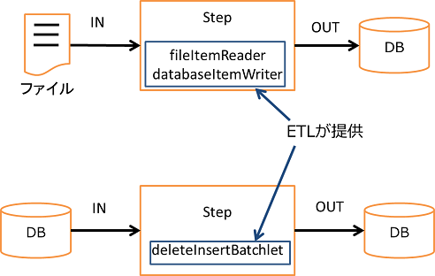
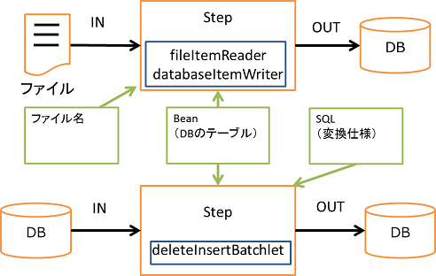

## JSR352とETLの簡単な説明
ここでは、ETL/ETLデザイナーを利用するにあたって、必要となるJSR352とETLの知識について簡単に説明します。

- [JSR352](#jsr352)
- [ETL](#etl)

## JSR352
- Jobは1個のバッチ処理を表します。なので、Jobが実行単位になります。
- Jobは一つ以上のStepが含まれます。StepによりJobの処理フローを表します。
- Stepの処理方法にはChunkとBatchletの2種類があります。
- Chunkは1件ずつ読み込み(ItemReader)と処理(ItemProcessor)を行い、一定件数毎に書き込み(ItemWriter)をまとめて行います。

  
  
- Batchletは一つの処理で完結するタスク指向の処理を行います。

  
  
## ETL

NablarchのETLでは、JSR352に準拠したバッチアプリケーションに、ChunkやBatchletの実装を追加する形でETLを実現しています。  
ETLで提供しているChunkやBatchletの詳細は[解説書](https://nablarch.github.io/docs/LATEST/doc/extension_components/etl/index.html)を参照ください。
  
- ETLでは、ファイルのデータをDBに取り込む、DBのテーブルのデータをSQLを利用して別テーブルに取り込む、取り込んだデータのバリデーションをするなどの処理を行うChunk、Batchletを提供しています。

  

- これらのChunk、Batchletが実際に処理するファイルやテーブル、SQLなどを設定ファイルに記述します。

  
  
- ETLデザイナーはGUIで上記の設定を行い、設定ファイルを出力します。