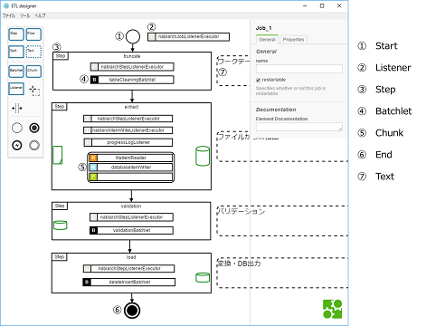
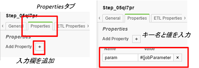
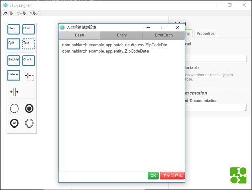
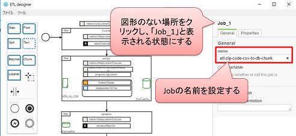

# 利用方法
- [インストール](#インストール)
- [テンプレート](#テンプレート)
- [アンインストール](#アンインストール)
- [図形の説明](#図形の説明)
- [図形の操作](#図形の操作)
- [バリデーション機能](#バリデーション機能)
- [入力候補値の設定](#入力候補値の設定)
- [JOB定義ファイルとETL用JOB設定ファイルへの変換](#job定義ファイルとetl用job設定ファイルへの変換)
- [設定ファイル](#設定ファイル)

## インストール
- zipファイルをダウンロードし、任意の場所に解凍します。
    - https://github.com/nablarch/nablarch-etl-designer/releases
- 解凍したフォルダ内のetl-designer.exeを実行するとETLデザイナーが起動します。

## テンプレート
- [etl-template.zip](https://github.com/nablarch/nablarch-etl-designer/raw/document/doc/download/etl-template.zip)をダウンロードして、解凍してください。
- 開発をする際に、作成するバッチのデータ形式と取り込み方法(Extractフェーズ/Loadフェーズ)が一番近いテンプレートを選択してください。

|データ形式|Extractフェーズ|Loadフェーズ|ファイル名|
|---|---|---|---|
|ファイル→DB|Batchlet(SQL*Loader)|Batchlet(洗い替え)|file2db_sql_loader_replace.bpmn|
|ファイル→DB|Batchlet(SQL*Loader)|Batchlet(マージ)|file2db_sql_loader_merge.bpmn|
|ファイル→DB|Chunk|Batchlet(洗い替え)|file2db_chunk_replace.bpmn|
|ファイル→DB|Chunk|Batchlet(マージ)|file2db_chunk_merge.bpmn|
|ファイル→DB|Chunk|Chunk|file2db_chunk_chunk.bpmn|
|DB→ファイル|-|Chunk|db2file_chunk.bpmn|

## アンインストール
- etl-designer.exeをフォルダごと削除してください
- C:\Users\＜ユーザー名＞\AppData\Roaming\etl-designerフォルダに設定ファイルが残っているため、こちらのフォルダも削除してください。
- AppDataフォルダは隠しフォルダになっています。エクスプローラーで隠しフォルダが表示されるように設定を変更してください。

## 図形の説明

ETLデザイナーで用いる図形の説明です。



- Start:Jobの開始を表す図形です。
- Listener
    - Job、StepにListenerを設定できます。
- Step:Jobの１処理を表す図形です。
- Batchlet:Stepに設定するBatchletです。
    - プロパティパネルのref属性に使用するクラス名を設定します。
- Chunk:Stepに設定するChunkです。
    - Reader、Writer、Processorが同時に作成されます。
    - それぞれのプロパティパネルのref属性に使用するクラス名を設定します。
- End:ジョブの終了を表す図形です。
- Text:注釈をつけることができます。JOB定義には影響しません。

## 図形の操作
- 配置/追加
    - 左の図形パレットからドラッグ＆ドロップで図形を配置できます。
    - 図形を選択した際に図形の右に表示されるメニューからドラッグ＆ドロップで図形を追加できます。この方法で追加した図形は、矢印で繋がれた状態で生成されます。

- 選択/複数選択
    - 図形をクリックで選択できます。
    - Ctrl + クリックで複数選択ができます。
    - Shift + ドラッグで範囲を指定して選択できます。
    - パレットで範囲選択モードをクリックして、ドラッグすることでも範囲選択が可能です。
    - Ctrl + a ですべての図形が選択できます。

- 削除
    - 図形を選択してDelボタンまたはゴミ箱アイコンをクリックすることで削除できます。

- コピー＆ペースト
    - 図形を選択し、Ctrl + c でコピー、Ctrl + v で貼り付けができます。

- 元に戻す＆やり直し
    - Ctrl + z で元に戻す、Ctrl + y でやり直しができます。

- キャンバスの移動
    - 図形を配置していない場所をドラッグすることで、キャンバス全体を移動させることができます。
    - Ctrl + マウスホイールでキャンバスを上下させることができます。
    - Shift + マウスホイールでキャンバスを左右させることができます。

- 図形の検索
    - キャンバス上の図形を検索できます。
    - Ctrl + f で検索ボックスが表示されます。
    - 検索ボックスに入力した文字列に合致する図形がハイライトされ、画面の中心に移動します。

- キャンバスの拡大・縮小
    - マウスホイールでキャンバスの拡大・縮小ができます。
    - Ctrl + + で拡大、Ctrl + - で縮小ができます。

- プロパティの追加
    - Propertiesタブで図形に対して任意のプロパティが追加できます。
    - 複数個設定できます。
    - この設定はJOB定義ファイルに出力されます。
    
    

## プロパティの設定
- ETLの設定を行う際は、ステップを選択してプロパティパネルからETLに必要な属性の設定を行います。
- steptypeは該当ステップが行う処理の種類です。以下の5種類があります。

|steptype|処理内容|
|----|----|
|truncate|指定されたentityのテーブルをクリアします|
|file2db|ファイルのデータをDBのテーブルに取り込みます|
|validation|取り込んだデータの妥当性チェックを行います|
|db2db|テーブルのデータを別のテーブルに変換・出力します|
|db2file|テーブルのデータをファイルに出力します|

- steptype毎に必要な属性を設定します。各項目にどのような値を設定するかは、[Nablarchドキュメント](https://nablarch.github.io/docs/LATEST/doc/extension_components/etl/index.html)の各タイプの項を参照ください。
- ※db2dbのみ一部表示名がドキュメントと異なっております。

|ETLデザイナー上での属性名|ドキュメント上の属性名|
|----|----|
|extract bean|updateSize.bean|
|commit interval|updateSize.size|

## バリデーション機能
- バリデーション機能では、定義したジョブのチェックを行います。
- メニューバーからツール＞バリデーションを選択するとバリデーションのウィンドウが表示されます。
- ウィンドウが表示された時点で、ジョブ定義のチェックが実行され結果がエラーと警告のタブに表示されます。
- エラー
    - ジョブを実行するとエラーになるもの
    - 必須項目の未設定
    - ジョブのname属性が未設定
    - ステップのname属性が重複している
- 警告
    - エラーにはならないが、修正すべきもの
    - ジョブレベルリスナーが未設定
    - ステップのname属性が未設定
- テスト実行
    - job-streamerのAPIを利用して、ジョブのテスト実行を行います。
    - ジョブの構造がループしていること、ステップのname属性の重複をチェックできます。
    - listener、batchlet、chunkをテスト用の空のものに置き換えてサーバ上で実行します。
    - テスト実行でエラーが発生した場合はStacktraceが表示されます。
    - サーバにアクセスできない環境では利用できません。
- 再チェックボタンを押すことで再度ジョブ定義のチェックが実行できます。
    
## 入力候補値の設定
- プロパティパネルのプルダウンメニューは、値の手入力と候補値からの選択の両方が可能なものがあります。
- bean、entity、errorEntityは、選択候補値をユーザ側で追加できます。
- 頻繁に使用する値は選択候補に追加することで、スムーズに作業ができます。
- メニューバーのツール＞設定を選択すると入力候補値設定ウィンドウが表示されます。
- 候補値を設定したい属性のタブを選択し、候補値を入力します。
- 複数追加したい場合は改行して入力していきます。
- OKボタンを押すと入力候補値の設定が保存されます。

  

## JOB定義ファイルとETL用JOB設定ファイルへの変換
- ETLデザイナー上で作成したジョブをJOB定義ファイルとETL用JOB設定ファイルへ変換します。
- ツール＞変換を選択すると、保存ダイアログが表示されます。
- JOB定義ファイルとETL用JOB設定ファイルが同じ場所に保存されます。
- 変換する際には、Jobのname属性を設定する必要があります。
- ETLデザイナのキャンバスで図形を選ばない状態で、プロパティパネルの「General」を選択し、「name」属性を入力します。
  
  

- 入力された名前は、JOB定義ファイルのジョブIDとして使用される他、JOB定義ファイルとETL用JOB設定ファイルの名前に使用されます。
- JOB定義ファイルのジョブIDとJOB設定ファイルのファイル名は一致させなければならないため、保存ダイアログでファイル名を変更せずに保存してください。

## 設定ファイル
- ETLデザイナーでは、アプリの設定を[json形式](http://www.json.org/json-ja.html)の設定ファイルに保存しています。
- 各種設定ファイルは、ETLデザイナー起動時に初期配置場所にファイルがなければ自動で生成されます。
- 設定ファイルを編集した後は、ETLデザイナーを終了して再度起動することで、変更した設定が反映されます。
- ※設定ファイルは、windows標準のメモ帳で開くとレイアウトが崩れます。別のテキストエディタを使用してください。
- ※設定ファイルがjson形式の文法に沿っていない場合、ETLデザイナーが正常に動作しません。編集する際はjson形式の文法をチェックできるエディタやIDEの使用を推奨します。
- 3種類の設定ファイルがあります。
    - registry.json：以下の設定ファイルのパス
    - appConfig.json：ETLデザイナー自体の設定（サーバの接続情報など）
    - propertiesConfig.json：ジョブ定義に使用するプロジェクト固有の設定
- registry.jsonは、etl-designer.exeと同じ階層に自動で生成されます。
- 参照したいappConfig.jsonとpropertiesConfig.jsonのパスを指定してください。
- ※json形式のため、Windowsの区切り文字である「¥」はエスケープして記述する必要があります。
- ＜ユーザー名＞の部分は自身のPC環境に応じて変更してください。
- registry.json
```
{
    "appConfig": "C:\\Users\\＜ユーザー名＞\\AppData\\Roaming\\etl-designer\\appConfig.json",
    "propertiesConfig": "C:\\Users\\＜ユーザー名＞\\AppData\\Roaming\\etl-designer\\propertiesConfig.json"
}
```
- ※appConfig.jsonとpropertiesConfig.jsonは、OS別に以下の場所が初期配置場所になります。
    - Windows: %APPDATA%¥etl-designer
    - Linux: $XDG_CONFIG_HOME/etl-designer or ~/.config/etl-designer
    - macOS: ~/Library/Application Support/etl-designer 

- appConfig.json
```
{
    "jobStreamer": {
       "url": "https://alfort.adc-tis.com/job-streamer-control-bus",
       "timeoutCount": 20
    },
    "locale": "ja",
    "xmlAttr": {
        "xmlns": "http://xmlns.jcp.org/xml/ns/javaee",
        "version": "1.0"
    }
}
```
- ETLデザイナーの設定が記述されています。
    - jobStreamer：APIサーバの設定
        - url: apiサーバのurl
        - timeoutCount: ジョブのテスト実行結果を取得しに行く回数(この回数を超えるとapiアクセスをタイムアウトさせる)
    - Locale：ETLデザイナーの言語設定
        - en（英語）とja（日本語）の2言語が選択可
    - xmlAttr：出力されるジョブxmlのjob要素に指定する属性
        - xmlns
        - version

- propertiesConfig.json
```
{
    "batchlet": [
        "tableCleaningBatchlet",
        "sqlLoaderBatchlet",
        "validationBatchlet",
        "deleteInsertBatchlet",
        "mergeBatchlet"
    ],
    "itemReader": [
        "databaseItemReader",
        "fileItemReader"
    ],
    "itemWriter": [
        "databaseItemWriter",
        "fileItemWriter"
    ],
    "itemProcessor": [],
    "listener": [
        "nablarchJobListenerExecutor",
        "nablarchStepListenerExecutor",
        "nablarchItemWriteListenerExecutor",
        "progressLogListener"
    ],
    "entities": [ ],
    "bean": [],
    "errorEntity": [ ],
    "mode": [
        "ABORT",
        "CONTINUE"
    ],
    "columns": [],
    "insertMode": [
        "NORMAL",
        "ORACLE_DIRECT_PATH"
    ],
    "stepType": {
        "truncate": [
            "entities"
        ],
        "validation": [
            "bean",
            "errorEntity",
            "mode",
            "errorLimit"
        ],
        "file2db": [
            "fileName",
            "bean"
        ],
        "db2db": [
            "extractBean",
            "bean",
            "sqlId",
            "mergeOnColumns",
            "insertMode",
            "updateSize"
        ],
        "db2file": [
            "bean",
            "fileName",
            "sqlId"
        ]
    }
}
```
- ジョブ定義時に使用するバッチコンポーネント、 ETL利用時に必要なbean、entityなどが記述されています。
- このファイルに記述することで、ETLデザイナー上で プルダウンから選択できるようになります。
- バッチで使用するクラス
    - batchlet
    - itemReader
    - itemWriter
    - itemProcessor
    - listener
- ETL使用時に設定する項目
    - entities
    - bean
    - errorEntity
    - mode
    - columns
    - insertMode
- ※stepType以下の項目は編集しないでください。