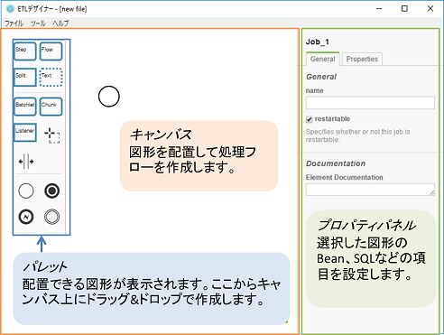
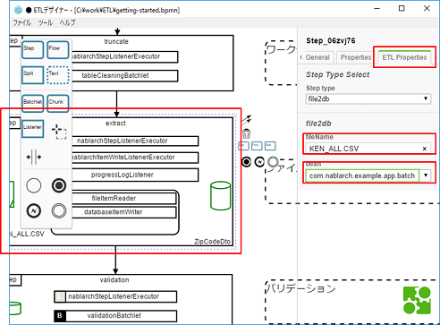
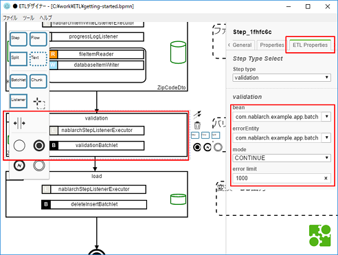

# チュートリアル

このチュートリアルでは、ETLデザイナーを使用して、テンプレートを用いたバッチの設計/実装から実行までを行います。
- 前提
- 設計するバッチ
- インストール
- 入力候補値の設定
- テンプレートを使用したバッチの設計
- 作業内容の保存・読み込み
- ジョブxmlとJSON設定ファイルの出力
- バッチの実行

## 前提
- バッチで用いる入力ファイル、bean、sql等及びバッチの実行環境は[nablarch-example-batch-ee](https://github.com/nablarch/nablarch-example-batch-ee)の物を利用します。
- nablarch-example-batch-eeのREADMEを参照して、3.2.アプリケーションのビルドまで実行してください。

## 設計するバッチ
- CSVファイルのデータを取り込み、データベースに保存するETLのバッチを設計/実装します
    - 使用するファイルは[郵便番号データ（全国一括）](http://www.post.japanpost.jp/zipcode/dl/kogaki-zip.html)を元に作成しています
- 以下のETLを設計します
    - ワークテーブルをクリーニングする
    - CSVファイルのデータをワークテーブルに取り込む
    - ワークテーブルに取り込んだデータをバリデーションする
    - ワークテーブルのデータを洗い替えモードで本テーブルに取り込む
- 入力がファイル、出力がDBのETLバッチなので、file2dbのテンプレートを使用することで効率よく設計できます。

## インストール
- ETLデザイナー
    - zipファイルをダウンロードし、任意の場所に解凍します。
    - 解凍したフォルダ内のetl-designer.exeを実行するとETLデザイナーが起動します。
    - [セットアップガイド](./setup-guide.md)の設定ファイルの項を参照して、試用サーバの接続情報の設定を行ってください。
    - 試用サーバのURLは「https://alfort.adc-tis.com/job-streamer-control-bus」です。
- テンプレートファイルのダウンロード
    - バッチ設計のベースとなるテンプレートファイルを任意の場所にダウンロードしてください。

## 画面の説明
- etl-desginer.exeを実行すると、ETLデザイナーが起動します。
- 初期画面は以下のようになっています。
- 
- パレット、キャンバス、プロパティパネルからなります
    - パレット:配置できる図形が表示されます
    - キャンバス：図形を配置してジョブを設計します
    - プロパティパネル：選択した図形のbean、sqlIdなどの項目を設定します

## 入力候補値の設定
- プロパティパネルのプルダウンメニューは、値の手入力と候補値からの選択の両方が可能なものがあります。
- bean、entity、errorEntityは、選択候補値をユーザ側で追加できます。
- 頻繁に使用する値は選択候補に追加することで、スムーズに作業ができます。
- メニューバーのツール＞設定を選択すると入力候補値設定ウィンドウが表示されます。
- 候補値を設定したい属性のタブを選択し、候補値を入力します。
- 複数追加したい場合は改行して入力していきます。
- 今回のチュートリアルでは以下の値を追加してください
- bean
    - com.nablarch.example.app.batch.ee.dto.csv.ZipCodeDto
    - com.nablarch.example.app.entity.ZipCodeData
- entity
    - com.nablarch.example.app.batch.ee.dto.csv.ZipCodeDto
- errorEntity
    - com.nablarch.example.app.batch.ee.dto.csv.ZipCodeErrorEntity
- OKボタンを押すと入力候補値の設定が保存されます。
- 

## テンプレートを利用したバッチの設計(ファイル→DB)
- メニューバーからファイル＞開くを選択し、ダウンロードしたテンプレートファイルの中からfile2dbテンプレートを選択して読み込みます。
- 今回のバッチではチャンクステップでProcessorを利用しないため、Processorの図形を削除します。
    - 緑地に白文字で「P」のラベルがついた横長の長方形の図形がProcessorです。
    - 図形をクリックすると、選択した図形の四隅に白い四角が表示され、図形が点線で囲まれます。  
    - 画面右のプロパティパネル上部に、選択した図形の種類が表示されます。
    - file2dbテンプレートでは、extractステップとloadステップのChunkにProcessorが初期設定されています。
    - Processorを選択し、図形の右に表示されるゴミ箱ボタンを押すか、deleteボタンを押すことで削除ができます。
    - 
- truncateステップの設定をします。
    - 
    - truncateステップを選択し、プロパティパネルのETL Propertiesタブを選択します
    - truncate entityで「com.nablarch.example.app.batch.ee.dto.csv.ZipCodeDto」を選択し、「＋」ボタンを押して追加します
- extractステップの設定をします
    - 
    - extractステップを選択し、プロパティパネルのETL Propertiesタブを選択します
    - fileNameに「KEN_ALL.CSV」を設定します
    - beanに「com.nablarch.example.app.batch.ee.dto.csv.ZipCodeDto」を設定します
- validationステップの設定をします
    - 
    - validationステップを選択し、プロパティパネルのETL Propertiesタブを選択します
    - beanに「com.nablarch.example.app.batch.ee.dto.csv.ZipCodeDto」を設定します
    - errorEntityに「com.nablarch.example.app.batch.ee.dto.csv.ZipCodeErrorEntity」を設定します
- loadステップを変更します
    - テンプレートのロードステップは、チャンクを利用してワークテーブルから本テーブルにデータを格納しています。
    - ここでは、バッチレットを利用したデータの洗い替えモードに変更します。
    - loadステップを選択して削除します。残りの矢印とEndも削除します。
    - 
    - 画面左のパレットからキャンバスに、Stepをドラッグアンドドロップで生成します。
    - 
    - プロパティパネルのGeneralタブのname属性に「load」を設定します。
    - プロパティパネルのETL PropertiesタブStep type属性にdb2dbを設定します。db2dbステップに必要な属性の設定欄が表示されます。
    - 
    - bean属性に「com.nablarch.example.app.entity.ZipCodeData」を設定します。
    - SQLIdに「SELECT_ZIPCODE_FROM_WORK」を設定します。
    - 
    - パレットからListenerとBatchletを上記手順で作ったStepの中に生成します。
    - Listenerを選択して、プロパティパネルのGeneralタブのref属性に「nablarchStepListenerExecutor」を設定します。
    - Batchletを選択して、プロパティパネルのGeneralタブのref属性に「deleteInsertBatchlet」を設定します。
    - 
    - validationステップを選択し、図形の右側に表示されるメニューの中から、矢印をドラッグアンドドロップしてloadステップに接続します。
        - ※このとき、画面を一定以上縮小していると図形右にメニューが表示されません。その際はマウスホイールを操作して画面を拡大してください。
    - 
    - loadステップを選択し、図形右側に表示されるメニューの中から、Endの図形をドラッグアンドドロップで生成します。
    - 

## ジョブの構造チェック・テスト実行
- ステップの名前が重複していないかや、プロパティパネルで必須項目が入力されているか等をチェックする機能があります。
- メニューバーからツール＞バリデーションを選択するとバリデーションウィンドウが表示されます。
- エラータブは、ジョブ実行時にエラーになる項目が表示されます。
    - プロパティパネルに必須属性が設定されていない
    - Stepのname属性が重複している
- 警告タブは、ジョブ実行時にエラーにはならないが設定しておくべき項目が表示されます。
    - Stepのname属性が設定されていない
    - Jobレベルのリスナーが設定されていない
- このチュートリアルではJobのname属性を設定していないため、エラータブにメッセージが表示されます。
- Jobのname属性を設定します。
- キャンバス上で図形がない場所を選択すると、プロパティパネルでJobの属性が編集できるようになります。  
Jobのname属性に「zip-code-csv-to-db」を設定します。
- 

## 作業内容の保存・読み込み
- 作業内容をbpmn形式のファイルに保存することができます。
- メニューバーからファイル＞名前を付けて保存を選択すると、名前を付けて保存のダイアログが表示されます。
- 保存場所、ファイル名を指定することで、編集内容を保存できます。拡張子は.bpmnでファイル形式はxmlファイルです。
- ファイル＞開くを選択すると開くダイアログが表示されます。
- 開きたいbpmnファイルを選択することで、再度編集が可能になります。

## ジョブxmlとJSON設定ファイルの出力
- 定義したジョブを、バッチで使用するジョブxmlとJSON設定ファイルに変換します。
- メニューバーのツール＞変換を選択します。
    - 変換の際にはJobのname属性が必須の項目となります。設定されていない場合は、設定してから再度変換を選択してください。
- ファイル保存のダイアログが現れるので、保存場所とファイル名を指定してファイルを保存します。
    - 保存する際のファイル名はJobのname属性に設定した値が初期値となっているため、そのファイル名のまま保存します。(今回はzip-code-csv-to-db)
- ※Jobのname属性はジョブxmlのJobのid属性にも反映されます。  
　　　ジョブxmlのJobのid属性とJSON設定ファイルのファイル名は一致させなければならないため、  
　　　保存ダイアログでファイル名を変更せずに保存してください。

## バッチの実行
- [nablarch-example-batch-ee](https://github.com/nablarch/nablarch-example-batch-ee)を用いてバッチを実行します。
- ジョブxmlファイルとJSON設定ファイルを以下の場所に配置します。
    - xml:<nablarch-example-batch-eeのフォルダ>/src/main/resources/META-INF/batch-jobs/
    - json:<nablarch-example-batch-eeのフォルダ>/src/main/resources/META-INF/etl-config/
- nablarch-example-batch-eeのREADMEの3.2.アプリケーションのビルドを行う。  
　`$mvn clean package`
- ファイルの追加や変更を行ったらその都度アプリケーションのビルドを実行してください。
- nablarch-example-batch-eeのREADMEの4.アプリケーションの実行を参照してバッチを実行してください。  
　`$mvn exec:java -Dexec.mainClass=nablarch.fw.batch.ee.Main -Dexec.args=<batch-job名>`
- <batch-job名>には、保存したジョブxmlのファイル名を指定してください。(今回はzip-code-csv-to-db)
- バッチを実行すると、KEN_ALL.CSVファイルのデータがZIP_CODE_DATAテーブルに取り込まれます。
- ZIP_CODE_DATAテーブルにデータが取り込まれたことを確認するために、nablarch-example-batch-eeで用意されているバッチを用いてテーブルのデータをcsvファイル形式で出力します。
- nablarch-example-batch-eeのREADMEの4.アプリケーションの実行を参照してetl-zip-code-db-to-csv-chunkバッチを実行してください。  
　`$mvn exec:java -Dexec.mainClass=nablarch.fw.batch.ee.Main -Dexec.args=etl-zip-code-db-to-csv-chunk`
- <nablarch-example-batch-eeのフォルダ>/testdata/output/以下にcsvファイルが出力されます。
- H2データベースのデータを直接確認することもできます。その場合は、nablarch-example-batch-eeのREADMEの5. DBの確認方法を参照してください。

## 終了
- 以上でチュートリアルは終了です。
- テンプレートで要件を満たせない場合は、loadステップの変更で行ったように、テンプレートを元に編集を行ってください。
- 詳細な設計/実装方法に関しては、ドキュメントを参照してください。